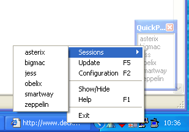

# QuickPutty
**[QuickPutty](https://github.com/wiesl/QuickPutty)** is a quick launcher application that allows to quickly launch a KiTTY/PuTTY session (e.g. SSH session) via a single double click.

It is currently maintained by Gerhard WIESINGER ("wiesl").

For a secure single sign on solution have a look at the SSH Agent [KeeAgent](https://lechnology.com/software/keeagent/) integrated into [KeePass](https://keepass.info/) compatible with KiTTY and PuTTY.

KiTTY can be found at the [KiTTY homepage](https://github.com/hknet/KiTTY/).

PuTTY can be found at the [PuTTY homepage](https://www.chiark.greenend.org.uk/~sgtatham/putty/).

**WARNING:** Please keep in mind that the following homepage is **NOT** an official PuTTY site, therefore not linked: [https://putty.org/]()).

## Screenshots

*(click an image to enlarge)*

Screnshot of the QuickPutty application with config dialog:

---

## ⬇️ Download
Grab the latest build from the **[Releases page →](https://github.com/wiesl/QuickPutty/releases/latest)**.

---

## Known issues
Currently no issues are known. As the new [KiTTY](https://github.com/hknet/KiTTY) evolves and a new directory structure has been implemented: Changes might be necessary to support the new directory structure.

Found something else? Please **[open an issue](https://github.com/wiesl/QuickPutty/issues)**.

---

## License & Credits
### License
Feel free to modify the source, as long as you respect LGPL licensing.
Pull requests are welcome.

---

### Credits
**[QuickPutty](https://github.com/wiesl/QuickPutty)** has been originally developed with PuTTY support by Olivier DECKMYN (thnx.). Later on Gerhard WIESINGER ("wiesl") has added support for KiTTY.

- **QuickPutty old download page** © Olivier DECKMYN & Gerhard WIESINGER ("wiesl") [QuickPutty old download page](https://www.wiesinger.com/opensource/QuickPutty/).
- **KiTTY currently maintained version** © Harald Kapper & Cyril Dupont (9bis) [KiTTY homepage](https://github.com/hknet/KiTTY).
- **KiTTY original version (unmaintained)** © Cyril Dupont (9bis) [old KiTTY homepage](https://www.9bis.net/kitty/).
- **PuTTY** © [Simon Tatham](https://github.com/sgtatham) and the PuTTY team [PuTTY homepage](https://www.chiark.greenend.org.uk/~sgtatham/putty/).
